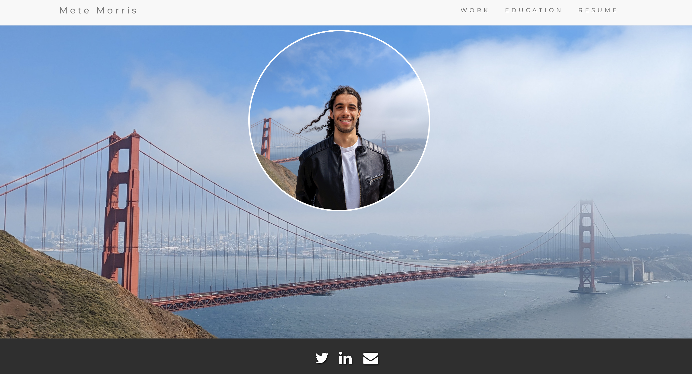

The first "website" I built was sometime around 2006/2007. It was for my clan in Ikariam.  
That introduced me to HTML/CSS, but once the job was done, I did not really go further.

Following that, as a freshman Computer Engineering student, I built my personal website with large ambitions, hoping it
would help me land internships. While I am not sure if it had any impact in me eventually getting some internships, it
was an iterative process keeping it up to date as life progressed.

_Figure 1: My old personal website_

This was heavily inspired by Debarghya Das' website, which I found to be very well designed and informative.  
The old site is a static Bootstrap 3 build.

---

## Old Stack

- HTML + Bootstrap 3 for layout and components  
- jQuery + Bootstrap JS for interactivity  
- Font Awesome icons + Google Fonts (Montserrat)  
- Custom CSS in a single stylesheet  
- Fully static — no build tooling, frameworks, or bundlers  

---

Fair to say web design has changed a lot since then, certainly in ways that I think are for the better.  
Now when you browse personal websites it is a lot more retro and minimalist, and I love that.

I wanted to learn some new tools and give my personal site a proper upgrade, so I decided to rebuild it from the ground
up. Since I use the Gemini CLI a lot at work, it was also a great excuse to try Codex on something fun and personal.

---

## New Stack (2025)

- Astro 5.15 as the static site framework  
- Tailwind CSS for styling (plus a small global stylesheet)  
- MDX + Astro content collections for posts and frontmatter  
- Vite + PostCSS/Autoprefixer for build tooling  
- Minimal client-side JS (theme toggle only), otherwise fully static assets  

---

And most importantly, I actually added my blog!

I am hoping to write about my personal interests and experiences in tech, software development, and more.  
Stay tuned for more posts to come!

\- Mete
