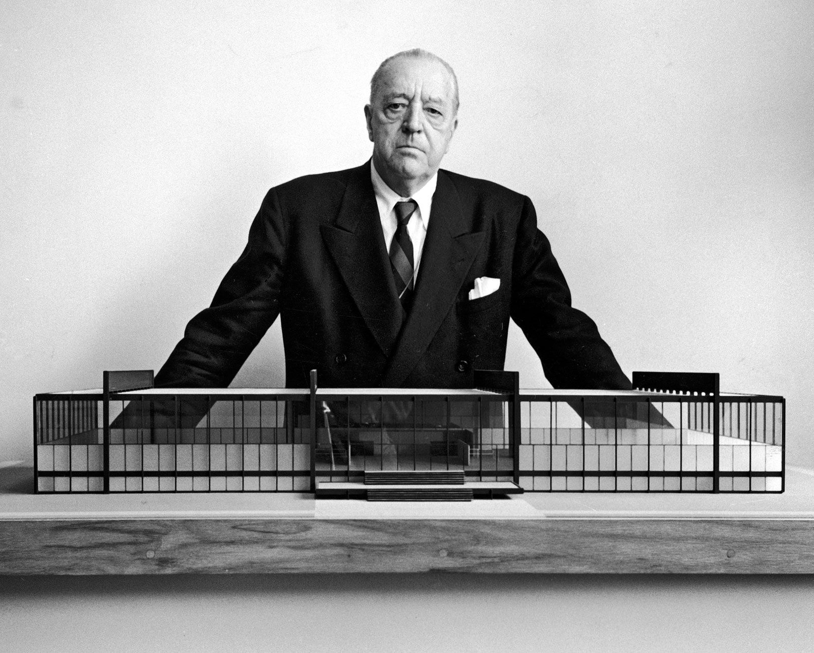
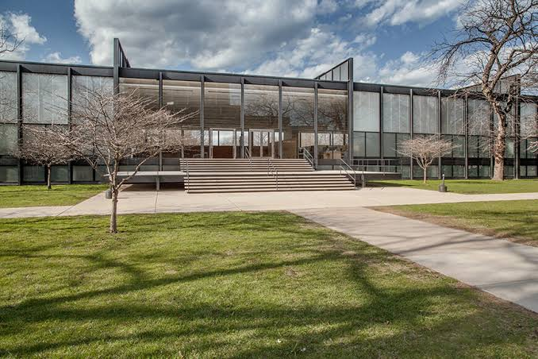
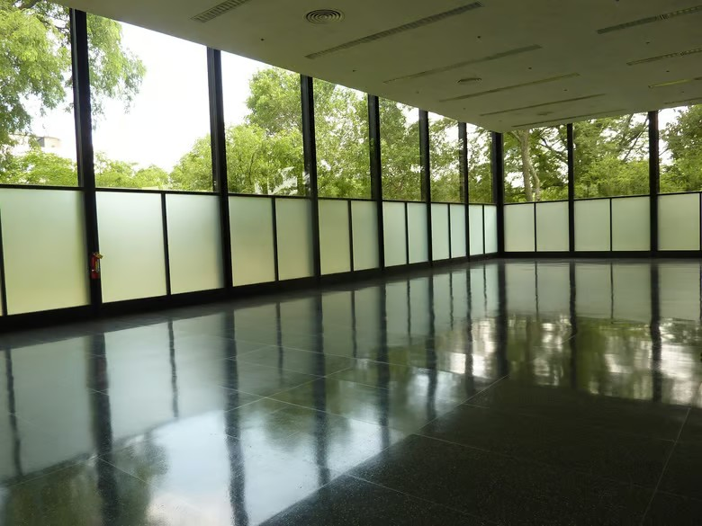
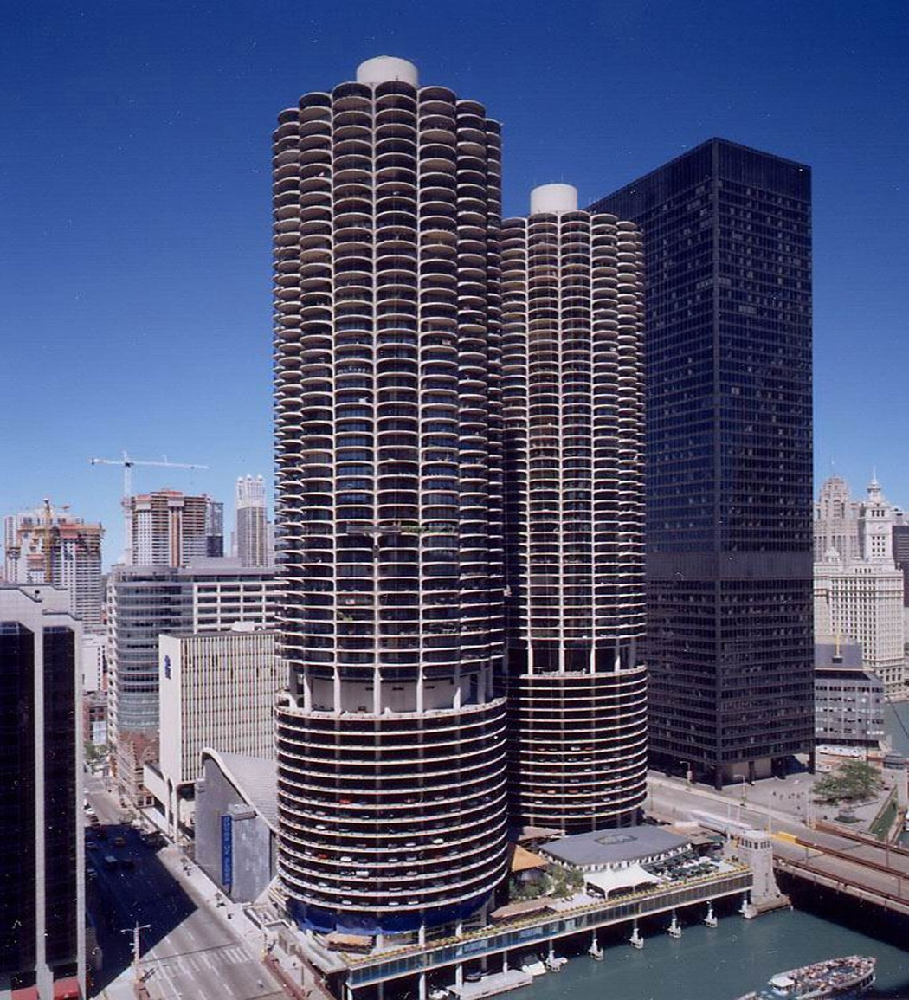

The first time I walked into "The Commons," the cafeteria of the Illinois 
Institute of Technology (IIT), two huge posters hung over the room.

On the left was a portrait of Martin Cooper, the inventor of the modern cell phone and 
a famous alumnus of the Electrical and Computer Engineering department, holding a Motorola DynaTAC,
his trademark invention.  The absence of text drew your attention to his bright 
smile and his magnum opus.

_Figure 1: Martin Cooper holding the Motorola DynaTAC he invented_

On the right was a more enigmatic portrait of a man staring directly down the 
lens, only his forehead and eyes visible. His portrait was boxed between two 
words, all caps: "LESS" on top and "IS" on the bottom. I could not recognize 
the man. My biological LLM rightfully predicted "More" as the next word, but 
this did not help me decipher his identity.

I turned and asked a fellow freshman I'd met that day, an architecture major, who 
the man on the right was. She said, "Mies van der Rohe, the reason I came to IIT," 
clearly disappointed I could not recognize her hero.

_Figure 2: Mies van der Rohe standing behind a model of Crown Hall_

I knew Mies van der Rohe from our brochure as the founder of our Department of Architecture and as a prolific architect, but not much more. 
In order not to disappoint any of my other peers pursuing architecture, I decided to do a bit of research.

As a pioneer of International Style in architecture, I would break down the core tenets of his philosophy as follows:

- Function First: eliminate everything that is not load-bearing or essential.
- Honesty: show the materials, no ornaments or fakes. 
- Transparency: glass walls and minimalist design make you feel like you are outside while you are inside. 

_Figure 3: S. R. Crown Hall, home to IIT's College of Architecture, designed by Mies_

_Figure 4: Crown Hall's column-free interior, where glass walls blur the line between inside and out_

While I really appreciated the philosophy, the contrarian 18-year-old version of 
me was not that impressed. It just seemed like a bunch of buildings that looked 
like giant rectangles.

My appreciation of the International Style grew when I was removed from its Mecca.
Johns Hopkins' Homewood campus felt like the antithesis of IIT. I was initially impressed by the Georgian architecture of Hopkins' campus. But my moment of appreciation for the International Style arrived in my first week there, when I got lost in a labyrinth of hallways and ended up (via underground tunnels) in a completely different building, missing a class. 
I had taken for granted the ease, comfort, uniformity, and simplicity Mies had established on my previous campus.

It is not that I did not get lost at IIT, especially in my early days, but when 
I got lost there, I felt like the campus was working with me. Moving through the 
IIT campus (which was largely designed by Mies) felt like floating downstream in a river. 
Spending long hours studying inside the buildings did not feel taxing: prioritizing 
natural light and the purpose of the space over ornamentation meant the inside 
felt like the outside.

**Prioritizing the function of a building inherently means prioritizing the humans who will use it.**

The brilliance of that initial poster is clear to me today. If it had been decorated 
with his name, the full phrase, and a brief description, it would not have been as memorable. 
The influence of Mies's minimalism was so embedded in IIT that it even spread to Martin Cooper's poster,
rightfully forcing your focus solely on his invention. 
The minimalism that pushed the designer to exclude "MORE" from "LESS IS" was 
itself the message: it makes you explore and seek the meaning yourself. 

The International Style was born as a rebellion against mainstream thought in the early 20th 
century, inspired by recent developments in technology. [The Cities We Build](https://aristotelis.eco/the-cities-we-build) 
by Aristotelis Economides talks brilliantly about its history and purpose. Like any idea or 
trend, the International Style is going through its thesis, antithesis, and synthesis phases. 
Some of Mies's students shared my initial lack of enthusiasm — the canonical example being
Marina City by his student (and IIT grad) Bertrand Goldberg, who grew fed up with minimalism 
and decided to pave his own path forward. We have entered the synthesis era, with
the International Style and Postmodernism evolving into Critical Regionalism.

_Figure 5: Marina City, Bertrand Goldberg's departure from the minimalism of his Miesian training_

We are going through a major revolution in how we build software, in a way, an industrial revolution of our own. 
Our capabilities have expanded monumentally, and so have our ambitions. 
It is tempting to get drunk on all the possible verticals and features that can be added to a product, features that were previously infeasible.
But remember, just like adding a decorative fixture to a building, every ornament you add is an additional path for the user
and adds context for you (and your agents as an extension of you) to maintain.
Before sending that prompt in Claude Code, consider: is this going to be bearing load, or am I adding an ornament? 
